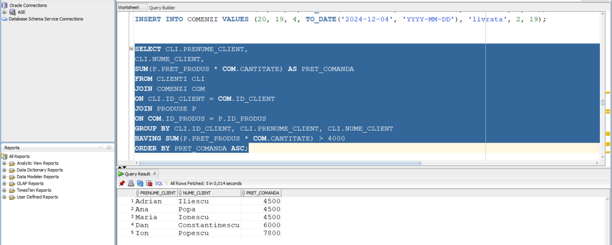

> <u>Proiect Baze de Date</u> Crearea unei baze de date pentru un
> magazine online
>
> Poalelungi Robert-Florin – 1062D

Obiectivul proiectului este reprezentat de crearea unei baze de date
pentru un magazin online de electronice. Scopul acestei baze de date
este de a centraliza activitatea economică a firmei oferind o platformă
solidă pentru gestionarea eficientă a informațiilor și optimizarea
proceselor operaționale. Baza de date centralizeaza informatiile
esentiale pentru buna desfasurare a activitatilor economice ale
magazinului, fiind formata din 5 tabele: Produse,
Clienti,Departamente,Angajati si Comenzi.

Relatia DEPARTAMENTE -ANGAJATI

Intre tabela DEPARTAMENTE si tabela ANGAJATI exista o legătura de
ONE-TO-MANY, deoarece un departament poate avea mai multi angajati dar
un angajat poate apartine unui singur departament.

Relatia CLIENTI - COMENZI

Intre tabela CLIENTI si tabela COMENZI exista o legatura de ONE-TO-MANY,
deoarece unclientpoate plasa maimulte comenzi dar ocomandaapartine unui
singur client

Relatia PRODUSE - COMENZI

Intre tabela PRODUSE si tabela COMENZI exista o legătură de
MANY-TO-MANY, deoarece un produs poate fi inclus in mai multe comenzi si
o comanda poate conține mai multe produse.

Relatia ANGAJATI - COMENZI

Intre tabela ANGAJATI si tabela COMENZI existao legăturadeONE-TO-MANY,
deoarece un angajat poate procesa mai multe comenzi dar o comanda este
procesata de un singur angajat.

> <u>Creare tabele</u>

DROPTABLE COMENZI CASCADE CONSTRAINTS;

DROPTABLE PRODUSE CASCADE CONSTRAINTS;

DROPTABLE DEPARTAMENTE CASCADE CONSTRAINTS;

DROPTABLE ANGAJATI CASCADE CONSTRAINTS;

DROPTABLE CLIENTI CASCADE CONSTRAINTS;

CREATE TABLE PRODUSE (

ID_PRODUS NUMBER(6) CONSTRAINT PK_PRODUSE PRIMARY KEY,

DENUMIRE_PRODUS VARCHAR2(50) NOT NULL,

PRET_PRODUS NUMBER(8,2)

);

CREATE TABLE CLIENTI (

ID_CLIENT NUMBER(6) CONSTRAINT PK_CLIENTI PRIMARY KEY,

PRENUME_CLIENT VARCHAR2(20),

NUME_CLIENT VARCHAR2(20),

TELEFON VARCHAR2(10),

EMAIL_CLIENT VARCHAR2(30),

ADRESAVARCHAR2(40),

COD_POSTALVARCHAR2(12),

ORAS VARCHAR2(30)

);

CREATE TABLE DEPARTAMENTE (

ID_DEPARTAMENT NUMBER(4) CONSTRAINT PK_DEPARTAMENTE PRIMARY KEY,

DENUMIRE_DEPARTAMENT VARCHAR2(30)

);

CREATE TABLE ANGAJATI (

ID_ANGAJAT NUMBER(6) CONSTRAINT PK_ANGAJATI PRIMARY KEY,

PRENUME VARCHAR2(20),

NUME VARCHAR2(25),

EMAILVARCHAR2(25),

DATA_ANGAJARE DATE,

SALARIU NUMBER(8,2),

ROLVARCHAR2(30),

ID_DEPARTAMENT NUMBER(4),

CONSTRAINT FK_ANGAJATI_DEPARTAMENT FOREIGN KEY (ID_DEPARTAMENT)
REFERENCES DEPARTAMENTE(ID_DEPARTAMENT)

);

CREATE TABLE COMENZI (

ID_COMANDANUMBER(12) CONSTRAINT PK_COMENZI PRIMARY KEY,

> ID_CLIENT NUMBER(6),

ID_PRODUS NUMBER(6),

DATA_COMANDADATE,

STATUS_COMANDAVARCHAR2(20),

CANTITATE NUMBER(8),

ID_ANGAJAT NUMBER(6),

CONSTRAINT FK_COMENZI_CLIENT FOREIGN KEY (ID_CLIENT) REFERENCES
CLIENTI(ID_CLIENT),

CONSTRAINT FK_COMENZI_PRODUS FOREIGN KEY (ID_PRODUS) REFERENCES
PRODUSE(ID_PRODUS),

CONSTRAINT FK_COMENZI_ANGAJAT FOREIGN KEY (ID_ANGAJAT) REFERENCES
ANGAJATI(ID_ANGAJAT)

);

> <u>Modificari</u>

ALTER TABLE ANGAJATI

ADD(TELEFON VARCHAR2(10));

ALTER TABLE PRODUSE

RENAME TO PRODUSE_MAGAZIN;

ALTER TABLE DEPARTAMENTE

ADD CONSTRAINT CHECK_DEPARTAMNETE CHECK(DENUMIRE_DEPARTAMENT IN
('Vanzari', 'Marketing', 'IT', 'Financiar-contabil', 'Logistic',
'Resurse umane', 'Customer service'));

ALTER TABLE CLIENTI

ADD CONSTRAINT CHECK_EMAIL_CLI CHECK(EMAIL_CLIENT LIKE ‘%@%.%’);

ALTER TABLE COMENZI

ADD CONSTRAINT CHECK_STATUS_COMANDA CHECK(STATUS_COMANDA IN (‘livrata’,
‘in procesare’, ‘anulata’));

ALTER TABLE CLIENTI

ADD(SEX VARCHAR(1));

ALTER TABLE CLIENTI

DROP COLUMN SEX;

ALTER TABLE ANGAJATI

MODIFY EMAILVARCHAR2(30);

ALTER TABLE ANGAJATI

ADD CONSTRAINT CHECK_EMAIL_ANG CHECK(EMAIL LIKE ‘%@%.%’);

ALTER TABLE CLIENTI

ADD(DATA_INREGISTRARE DATE);

ALTER TABLE CLIENTI

DROP COLUMN DATA_INREGISTRARE;

ALTER TABLE PRODUSE_MAGAZIN

RENAME TO PRODUSE;

> <u>Introducere date</u>

<u>Produse</u>

INSERT INTO PRODUSE VALUES (1, 'Laptop Lenovo IdeaPad 3', 2500);

INSERT INTO PRODUSE VALUES (2, 'Telefon Samsung Galaxy A53', 1800);

INSERT INTO PRODUSE VALUES (3, 'Televizor LG OLED 55 inch', 4500);

INSERT INTO PRODUSE VALUES (4, 'Casti wireless Sony WH-1000XM4', 1500);

INSERT INTO PRODUSE VALUES (5, 'Tastatura mecanica Logitech G915', 800);

INSERT INTO PRODUSE VALUES (6, 'Mouse gaming Razer DeathAdder V2', 300);

INSERT INTO PRODUSE VALUES (7, 'Monitor gamingASUS ROG Swift', 2000);

INSERT INTO PRODUSE VALUES (8, 'Imprimanta HP LaserJet Pro', 500);

INSERT INTO PRODUSE VALUES (9, 'Tableta grafica Wacom Intuos', 400);

INSERT INTO PRODUSE VALUES (10, 'Camera foto DSLR Canon EOS', 3000);

INSERT INTO PRODUSE VALUES (11, 'Smartwatch Apple Watch Series 7',
2000);

INSERT INTO PRODUSE VALUES (12, 'Boxa portabila JBL Flip 6', 500);

INSERT INTO PRODUSE VALUES (13, 'SSD Samsung 980 PRO 1TB', 800);

INSERT INTO PRODUSE VALUES (14, 'Placa video NVIDIAGeForce RTX 3070',
3000);

INSERT INTO PRODUSE VALUES (15, 'Procesor Intel Core i7-12700K', 1500);

INSERT INTO PRODUSE VALUES (16, 'Memorie RAM Corsair Vengeance 16GB',
400);

INSERT INTO PRODUSE VALUES (17, 'Carcasa PC Corsair 4000D Airflow',
300);

INSERT INTO PRODUSE VALUES (18, 'Sursa PC Corsair RM850x', 700);

INSERT INTO PRODUSE VALUES (19, 'Cooler CPU Noctua NH-D15', 500);

INSERT INTO PRODUSE VALUES (20, 'Monitor ASUS ProArt Display', 2500);

UPDATE PRODUSE

SET PRET_PRODUS = 3000

WHERE ID_PRODUS = 1;

<u>Clienti</u>

INSERT INTO CLIENTI VALUES (1, 'Ion', 'Popescu', '0745123456',
'ion.popescu@email.com', 'Str. Principala nr. 1', '123456',
'Bucuresti');

INSERT INTO CLIENTI VALUES (2, 'Maria', 'Ionescu', '0723456789',
'maria.ionescu@email.com', 'Str. Secundara nr. 10', '456789',
'Cluj-Napoca');

INSERT INTO CLIENTI VALUES (3, 'Andrei', 'Vasilescu', '0765432109',
'andrei.vasilescu@email.com', 'Str. Laterala nr. 25', '789012', 'Iasi');

INSERT INTO CLIENTI VALUES (4, 'Elena', 'Dobre', '0745987654',
'elena.dobre@email.com', 'Str. Florilor nr. 3', '321098', 'Timisoara');

INSERT INTO CLIENTI VALUES (5, 'George', 'Marin', '0723654321',
'george.marin@email.com', 'Str. Muncii nr. 15', '654321', 'Constanta');

INSERT INTO CLIENTI VALUES (6, 'Ana', 'Popa', '0765321098',
'ana.popa@email.com', 'Str. Unirii nr. 20', '987654', 'Craiova');

INSERT INTO CLIENTI VALUES (7, 'Mihai', 'Dumitrescu', '0745876543',
'mihai.dumitrescu@email.com', 'Str. Republicii nr. 5', '876543',
'Brasov');

INSERT INTO CLIENTI VALUES (8, 'Cristina', 'Manole', '0723543210',
'cristina.manole@email.com', 'Str. Victoriei nr. 12', '543210',
'Galati');

INSERT INTO CLIENTI VALUES (9, 'Alexandru', 'Stanescu', '0765210987',
'alexandru.stanescu@email.com', 'Str. Pacii nr. 8', '210987', 'Oradea');

INSERT INTO CLIENTI VALUES (10, 'Ioana', 'Radu', '0745765432',
'ioana.radu@email.com', 'Str. Zorilor nr. 18', '765432', 'Ploiesti');

INSERT INTO CLIENTI VALUES (11, 'Dan', 'Constantinescu', '0723321098',
'dan.constantinescu@email.com', 'Str. Libertatii nr. 22', '321098',
'Braila');

INSERT INTO CLIENTI VALUES (12, 'Laura', 'Georgescu', '0765109876',
'laura.georgescu@email.com', 'Str. Teilor nr. 30', '109876', 'Arad');

INSERT INTO CLIENTI VALUES (13, 'Adrian', 'Iliescu', '0745098765',
'adrian.iliescu@email.com', 'Str. Mihai Viteazu nr. 7', '098765',
'Pitesti');

INSERT INTO CLIENTI VALUES (14, 'Gabriela', 'Pop', '0723987654',
'gabriela.pop@email.com', 'Str.Avram Iancu nr. 14', '987654', 'Sibiu');

INSERT INTO CLIENTI VALUES (15, 'Tudor', 'Moldovan', '0765876543',
'tudor.moldovan@email.com', 'Str. Stefan cel Mare nr. 9', '876543',
'Targu Mures');

INSERT INTO CLIENTI VALUES (16, 'Anca', 'Rusu', '0745654321',
'anca.rusu@email.com', 'Str. Decebal nr. 11', '654321', 'Bacau');

INSERT INTO CLIENTI VALUES (17, 'Sergiu', 'Toma', '0723210987',
'sergiu.toma@email.com', 'Str. Cuza Voda nr. 23', '210987', 'Baia
Mare');

INSERT INTO CLIENTI VALUES (18, 'Oana', 'Petrescu', '0765098765',
'oana.petrescu@email.com', 'Str. Eminescu nr. 31', '098765', 'Satu
Mare');

INSERT INTO CLIENTI VALUES (19, 'Radu', 'Nedelcu', '0745987654',
'radu.nedelcu@email.com', 'Str. Kogalniceanu nr. 6', '987654',
'Botosani');

INSERT INTO CLIENTI VALUES (20, 'Andreea', 'Dincu', '0723876543',
'andreea.dincu@email.com', 'Str. Alexandru cel Bun nr. 16', '876543',
'Suceava');

DELETE FROM Clienti

WHERE ID_CLIENT = 20;

<u>Departmente</u>

INSERT INTO DEPARTAMENTE VALUES (1, 'Vanzari');

INSERT INTO DEPARTAMENTE VALUES (2, 'Marketing');

INSERT INTO DEPARTAMENTE VALUES (3, 'IT');

INSERT INTO DEPARTAMENTE VALUES (4, 'Financiar-contabil');

INSERT INTO DEPARTAMENTE VALUES (5, 'Logistic');

INSERT INTO DEPARTAMENTE VALUES (6, 'Resurse umane');

INSERT INTO DEPARTAMENTE VALUES (7, 'Customer service');

<u>Angajati</u>

INSERT INTO ANGAJATI VALUES (1, 'Robert-Florin', 'Poalelungi',
'robertpoalelungi@email.com', TO_DATE('2022-08-15', 'YYYY-MM-DD'),
10000, 'Director IT', 3, '0752857711');

INSERT INTO ANGAJATI VALUES (2, 'George', 'Marin',
'george.marin@email.com', TO_DATE('2023-01-10', 'YYYY-MM-DD'), 3500,
'Vanzator', 1, '0755333444');

INSERT INTO ANGAJATI VALUES (3, 'Ana', 'Popa', 'ana.popa@email.com',
TO_DATE('2023-03-20', 'YYYY-MM-DD'), 3000, 'Agent suport', 7,
'0755555666');

INSERT INTO ANGAJATI VALUES (4, 'Mihai', 'Dumitrescu',
'mihai.dumitrescu@email.com', TO_DATE('2022-05-05', 'YYYY-MM-DD'), 4500,
'Manager', 2, '0722111222');

INSERT INTO ANGAJATI VALUES (5, 'Cristina', 'Manole',
'cristina.manole@email.com', TO_DATE('2023-02-15', 'YYYY-MM-DD'), 3800,
'Specialist Marketing', 2, '0722333444');

INSERT INTO ANGAJATI VALUES (6, 'Alexandru', 'Stanescu',
'alexandru.stanescu@email.com', TO_DATE('2022-11-10', 'YYYY-MM-DD'),
5000, 'Dezvoltator Senior', 3, '0722555666');

INSERT INTO ANGAJATI VALUES (7, 'Ioana', 'Radu', 'ioana.radu@email.com',
TO_DATE('2023-04-01', 'YYYY-MM-DD'), 4200, 'Analist Financiar', 4,
'0733111222');

INSERT INTO ANGAJATI VALUES (8, 'Dan', 'Constantinescu',
'dan.constantinescu@email.com', TO_DATE('2022-09-20', 'YYYY-MM-DD'),
3200, 'Contabil', 4, '0733333444');

INSERT INTO ANGAJATI VALUES (9, 'Laura', 'Georgescu',
'laura.georgescu@email.com', TO_DATE('2023-01-25', 'YYYY-MM-DD'), 2800,
'Gestionar Depozit', 5, '0733555666');

INSERT INTO ANGAJATI VALUES (10, 'Adrian', 'Iliescu',
'adrian.iliescu@email.com', TO_DATE('2022-12-15', 'YYYY-MM-DD'), 4800,
'Manager', 5, '0744111222');

INSERT INTO ANGAJATI VALUES (11, 'Gabriela', 'Pop',
'gabriela.pop@email.com', TO_DATE('2023-03-05', 'YYYY-MM-DD'), 2900,
'Recruiter', 6, '0744333444');

INSERT INTO ANGAJATI VALUES (12, 'Tudor', 'Moldovan',
'tudor.moldovan@email.com', TO_DATE('2022-07-10', 'YYYY-MM-DD'), 4100,
'Trainer', 6, '0744555666');

INSERT INTO ANGAJATI VALUES (13, 'Anca', 'Rusu', 'anca.rusu@email.com',
TO_DATE('2023-05-12', 'YYYY-MM-DD'), 3300, 'Agent Customer Service', 7,
'0755777888');

INSERT INTO ANGAJATI VALUES (14, 'Sergiu', 'Toma',
'sergiu.toma@email.com', TO_DATE('2022-10-20', 'YYYY-MM-DD'), 3700,
'Manager Customer Service', 7, '0755999000');

INSERT INTO ANGAJATI VALUES (15, 'Oana', 'Petrescu',
'oana.petrescu@email.com', TO_DATE('2023-02-28', 'YYYY-MM-DD'), 4800,
'Manager', 1, '0766111222');

INSERT INTO ANGAJATI VALUES (16, 'Radu', 'Nedelcu',
'radu.nedelcu@email.com', TO_DATE('2022-06-18', 'YYYY-MM-DD'), 3100,
'Administrator retea', 3, '0766333444');

INSERT INTO ANGAJATI VALUES (17, 'Andreea', 'Dincu',
'andreea.dincu@email.com', TO_DATE('2023-04-10', 'YYYY-MM-DD'), 2700,
'Contabil junior', 4, '0766555666');

INSERT INTO ANGAJATI VALUES (18, 'Ioan', 'Stoica',
'ioan.stoica@email.com', TO_DATE('2022-11-05', 'YYYY-MM-DD'), 3900,
'Analist financiar', 4, '0777111222');

INSERT INTO ANGAJATI VALUES (19, 'Loredana', 'Cristea',
'loredana.cristea@email.com', TO_DATE('2023-01-18', 'YYYY-MM-DD'), 2600,
'Agent marketing', 2, '0777333444');

INSERT INTO ANGAJATI VALUES (20, 'Cosmin', 'Andrei',
'cosmin.andrei@email.com', TO_DATE('2022-09-30', 'YYYY-MM-DD'), 3400,
'Sef depozit', 5, '0777555666');

SELECT \*

FROM ANGAJATI

WHERE ID_ANGAJAT = 1;

--INSERT COMENZI

INSERT INTO COMENZI VALUES (1, 1, 2, TO_DATE('2023-05-15',
'YYYY-MM-DD'), 'livrata', 1, 2);

INSERT INTO COMENZI VALUES (2, 2, 3, TO_DATE('2023-06-10',
'YYYY-MM-DD'), 'in procesare', 1, 1);

INSERT INTO COMENZI VALUES (3, 1, 1, TO_DATE('2023-07-05',
'YYYY-MM-DD'), 'anulata', 2, 2);

INSERT INTO COMENZI VALUES (4, 3, 5, TO_DATE('2023-08-01',
'YYYY-MM-DD'), 'livrata', 1, 3);

INSERT INTO COMENZI VALUES (5, 4, 8, TO_DATE('2023-09-12',
'YYYY-MM-DD'), 'in procesare', 2, 4);

INSERT INTO COMENZI VALUES (6, 5, 12, TO_DATE('2023-10-03',
'YYYY-MM-DD'), 'livrata', 1, 5);

INSERT INTO COMENZI VALUES (7, 6, 15, TO_DATE('2023-11-20',
'YYYY-MM-DD'), 'anulata', 3, 6);

INSERT INTO COMENZI VALUES (8, 7, 18, TO_DATE('2023-12-15',
'YYYY-MM-DD'), 'livrata', 1, 7);

INSERT INTO COMENZI VALUES (9, 8, 2, TO_DATE('2024-01-08',
'YYYY-MM-DD'), 'in procesare', 2, 8);

INSERT INTO COMENZI VALUES (10, 9, 7, TO_DATE('2024-02-02',
'YYYY-MM-DD'), 'livrata', 1, 9);

INSERT INTO COMENZI VALUES (11, 10, 11, TO_DATE('2024-03-15',
'YYYY-MM-DD'), 'anulata', 1, 10);

INSERT INTO COMENZI VALUES (12, 11, 14, TO_DATE('2024-04-05',
'YYYY-MM-DD'), 'livrata', 2, 11);

INSERT INTO COMENZI VALUES (13, 12, 17, TO_DATE('2024-05-22',
'YYYY-MM-DD'), 'in procesare', 1, 12);

INSERT INTO COMENZI VALUES (14, 13, 3, TO_DATE('2024-06-18',
'YYYY-MM-DD'), 'livrata', 1, 13);

INSERT INTO COMENZI VALUES (15, 14, 6, TO_DATE('2024-07-11',
'YYYY-MM-DD'), 'anulata', 2, 14);

INSERT INTO COMENZI VALUES (16, 15, 9, TO_DATE('2024-08-06',
'YYYY-MM-DD'), 'livrata', 1, 15);

INSERT INTO COMENZI VALUES (17, 16, 13, TO_DATE('2024-09-23',
'YYYY-MM-DD'), 'in procesare', 3, 16);

INSERT INTO COMENZI VALUES (18, 17, 16, TO_DATE('2024-10-17',
'YYYY-MM-DD'), 'livrata', 1, 17);

INSERT INTO COMENZI VALUES (19, 18, 1, TO_DATE('2024-11-09',
'YYYY-MM-DD'), 'anulata', 1, 18);

INSERT INTO COMENZI VALUES (20, 19, 4, TO_DATE('2024-12-04',
'YYYY-MM-DD'), 'livrata', 2, 19);

> <u>Interogari</u>

1.Afisati clientii care au plasat comenzi cu valoarea mai mare de 4000
de lei si ordonatii crescator

SELECT CLI.PRENUME_CLIENT,

CLI.NUME_CLIENT,

SUM(P.PRET_PRODUS \* COM.CANTITATE) AS PRET_COMANDA

FROM CLIENTI CLI

JOIN COMENZI COM

ON CLI.ID_CLIENT = COM.ID_CLIENT

JOIN PRODUSE P

ON COM.ID_PRODUS = P.ID_PRODUS

GROUP BY CLI.ID_CLIENT, CLI.PRENUME_CLIENT, CLI.NUME_CLIENT

HAVING SUM(P.PRET_PRODUS \* COM.CANTITATE) \> 4000

ORDER BY PRET_COMANDAASC;

2.Afisati produsele de tip Laptop

SELECT \*

FROM PRODUSE

WHERE DENUMIRE_PRODUS LIKE 'Laptop%';

3.Afisati angajatii care au fost angajati dupa anul 2022

SELECT \*

FROM ANGAJATI

WHERE DATA_ANGAJARE \> TO_DATE('2022-01-01', 'YYYY-MM-DD');

4.Afisati media salariilor din departamentul IT

SELECT

ROUND(AVG(SALARIU)) AS SALARIU_MEDIU_IT

FROM ANGAJATI A

JOIN DEPARTAMENTE D

ONA.ID_DEPARTAMENT = D.ID_DEPARTAMENT

WHERE DENUMIRE_DEPARTAMENT = UPPER('it');

5.Afisati angajati care au procesat comenzi in anul 2024

SELECT

A.NUME,

A.PRENUME,

C.DATA_COMANDA

FROM ANGAJATI A

JOIN COMENZI C

ONA.ID_ANGAJAT = C.ID_ANGAJAT

WHERE C.DATA_COMANDA BETWEEN TO_DATE('2024-01-01', 'YYYY-MM-DD') AND
TO_DATE('2024-12-31', 'YYYY-MM-DD');

6.Afisati produsele cu pretul mai mic de 2000 de lei

SELECT

DENUMIRE_PRODUS,

PRET_PRODUS

FROM PRODUSE

WHERE PRET_PRODUS \< 2000;

7.Afisati angajatii cu salariul mai mare de 3000 de lei din
departamentul Vanzari

SELECT

A.NUME,

A.PRENUME,

A.SALARIU,

D.DENUMIRE_DEPARTAMENT

FROM ANGAJATI A

JOIN DEPARTAMENTE D

ONA.ID_DEPARTAMENT = D.ID_DEPARTAMENT

WHERE A.ID_DEPARTAMENT = 1

AND A.SALARIU \>= 3000

ORDER BYA.SALARIUASC;

8.Afisati comenzile livrate sau aflate in procesare

SELECT \*

FROM COMENZI

WHERE STATUS_COMANDA= 'livrata'

UNION

SELECT \*

FROM COMENZI

WHERE STATUS_COMANDA= 'in procesare';

9.Afisare clasificare orase

SELECT

PRENUME_CLIENT,

NUME_CLIENT,

CASE

WHEN ORAS = 'Bucuresti' THEN 'Bucuresti'

WHEN ORAS = 'Cluj-Napoca' THEN 'Cluj'

ELSE 'Alt oras'

END AS REGIUNE

FROM CLIENTI;

10.Construiti un table virtual cu angajatii IT si afisati angajatii IT
cu salariul mai mare de 3000 de lei

CREATE VIEWANGAJATI_ITAS

SELECT \*

FROM ANGAJATI

WHERE ID_DEPARTAMENT = 3;

SELECT \*

FROM ANGAJATI_IT

WHERE SALARIU \> 3000;

11.Afisati angajatii care au fost angajati in martie 2023

SELECT

NUME,

PRENUME,

DATA_ANGAJARE

FROM ANGAJATI

WHERE EXTRACT(YEAR FROM DATA_ANGAJARE) = 2023

AND EXTRACT(MONTH FROM DATA_ANGAJARE) = 3;

12.Creare index pret produs si afiare produse cu pretul mai mare de 1500

CREATE INDEX IDX_PRET_PRODUS ON PRODUSE (PRET_PRODUS);

SELECT \*

FROM Produse

WHERE PRET_PRODUS \> 1500;

13.Afisati toti angajatii si departamentele lor

SELECT

A.NUME,

A.PRENUME,

D.DENUMIRE_DEPARTAMENT

FROM DEPARTAMENTE D

LEFT JOIN ANGAJATI A

ON D.ID_DEPARTAMENT =A.ID_DEPARTAMENT;

14.Afisati clientii care au comandat in ultmele 6 luni

SELECT

CLI.NUME_CLIENT,

CLI.PRENUME_CLIENT,

COM.DATA_COMANDA

FROM CLIENTI CLI

JOIN COMENZI COM

ON CLI.ID_CLIENT = COM.ID_CLIENT

WHERE COM.DATA_COMANDA\>=ADD_MONTHS(SYSDATE, -6);

15.Afisati angajatii care sunt Manageri

SELECTA.PRENUME, A.NUME, A.ROL

FROM ANGAJATI A

WHERE A.ROL LIKE '%Manager%';
